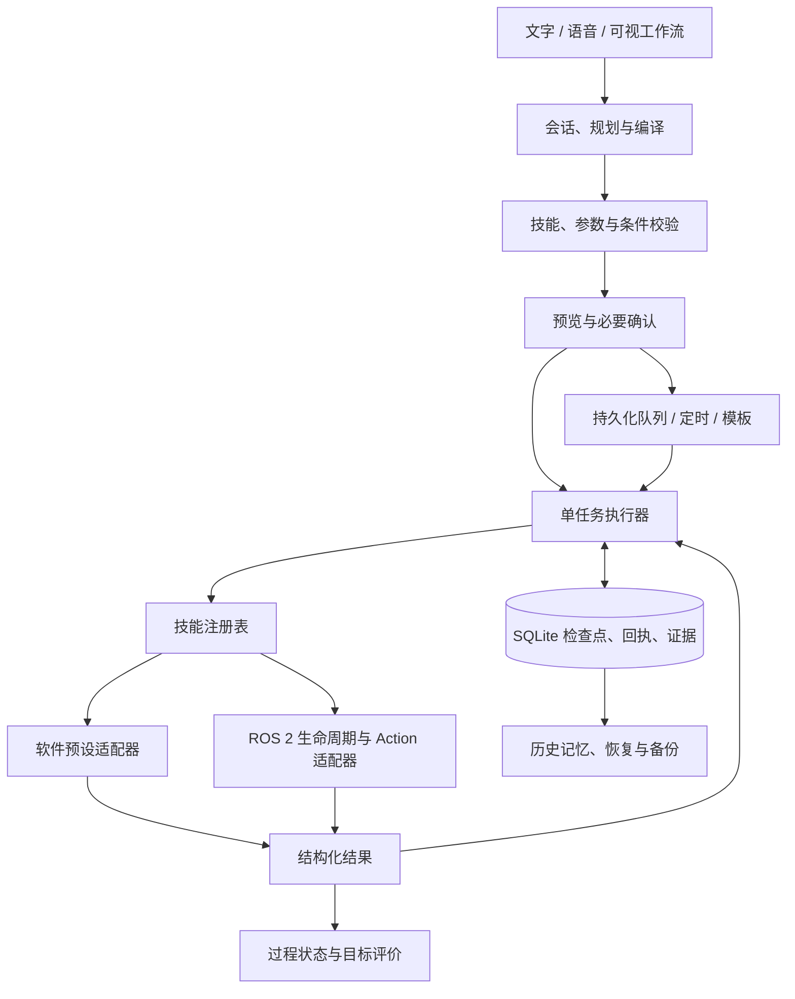

> V5 新增生活辅助服务与四项家居技能。本文保留原有任务平台的说明；新增接口与边界见 [HOME_INTERFACES.md](HOME_INTERFACES.md) 和 [ASSISTIVE_API.md](ASSISTIVE_API.md)。

# V4 架构与 API

## 数据流

规划不执行动作。规则、模型和工作流都经过同一个 Plan 验证器；执行器仅接收已注册技能、已配置地点与有限参数。模型没有 Python、shell、任意 URL 或动态导入权限。停止控制绕过规划锁，并使迟到规划失效。

## 模块职责

| 文件 | 责任 |
|---|---|
| contracts.py / config.py | 数据契约、适配器接口、配置校验 |
| planner.py / natural_language.py / model_provider.py | 指令解析、会话草稿、修订、调度语义、可选模型 |
| workflow.py / plan_validation.py | DSL 编译、类型化参数、条件三值逻辑、目标评价 |
| engine.py | 任务状态机、检查点、暂停/停止/重试、报告、公共业务 API |
| scheduling.py / scheduler.py | 时区/周期计算、持久化串行队列与派发 |
| skills.py / lifecycle.py | 技能声明、参数验证、可信插件执行、生命周期转移 |
| store.py | SQLite 迁移、排他锁、事务、任务/观察/队列/模板/回执 |
| memory.py / recovery.py | 有来源的历史查询、剩余任务重建与远端核对 |
| data_management.py | 一致性备份、哈希验证、离线恢复、归档策略 |
| mock_adapter.py / ros_adapter.py / ros_node.py | 软件预设数据、ROS Action/能力/UUID、管理节点 |
| audio.py / voice_sessions.py / voice_client.py | 文件与流式 ASR、分段修订、TTS 适配、可选麦克风 CLI |
| server.py | 同源 HTTP、资源白名单、大小限制和错误响应 |
| web/app.js / workspace.js | 任务控制台及工作流、模板、队列、数据产品界面 |
| web/voice.js / streaming-voice.js / pcm-worklet.js | 语音状态机、PCM 传输、音频下采样和取消 |

## 状态、证据与一致性

任务状态包括 idle、running、pausing、paused、cancelling、succeeded、failed、cancelled。进程重启会把未完成任务标记为 interrupted。步骤另有 pending、retrying、skipped 等状态。派发前保存检查点，返回后核对类型、目标、证据和时间再记录。

条件只引用此前步骤；all/any/not 使用三值逻辑。失败、跳过或不确定观察不能推断 found/not_found，not(未知) 仍为未知。显式 inconclusive 可以进入专门分支。on_failure=continue 只允许已确认结束的失败进入后续步骤，未决外部目标仍阻塞。

报告独立给出执行状态和 goal_outcome。目标结果为 achieved、not_achieved、unknown 或 not_applicable。恢复后的报告只评价新计划覆盖的观察；原任务证据保留在关联历史中，不能据此推断物体现在仍在原处。

暂停通过取消当前适配器操作实现，确认终态后才进入 paused；继续时重执行该未完成步骤。已完成步骤不会重新运行。ROS 目标 UUID、Action 名称与步骤 ID 持久化；重启恢复必须核对相关外部状态。状态不可查询或已从远端状态历史消失时，恢复会保守阻塞。

SQLite 使用 WAL/FULL，同一数据库有 OS 排他锁。任务创建与请求关联在同一事务内保存。队列先落盘 dispatching，再以确定性 `(job_id, occurrence)` 请求 ID 提交任务；派发回执中断时能从任务请求关联找回。队列在重启后暂停，避免未经核对重放。系统不承诺数据库与远端 ROS Action 的分布式 exactly-once。

就绪队列按优先级降序、到期时间和创建时间排序；只执行一个任务。周期任务跳过错过的周期，不堆积补跑。配置指纹变化会阻止旧队列计划派发。全局停止同时暂停队列。

## HTTP API

默认 `http://127.0.0.1:8768`。JSON 为 UTF-8，正文最多 256 KiB；重复 JSON 键和非有限数拒绝。PCM chunk 最大 32,000 字节，WAV 最大 10 MiB。Host、Origin 和跨站请求受限；默认绑定本机回环。服务没有面向互联网的用户认证系统。容器绑定与允许 Host 必须显式配置。

| 方法与路径 | 内容 |
|---|---|
| GET /api/state | 当前任务、机器人状态、事件、队列摘要、生命周期和技能 |
| POST /api/plan | `{text,session_id?}`，仅预览或澄清 |
| POST /api/command | `{text,request_id?,session_id?}`，任务/队列/澄清/确认回执 |
| POST /api/control | `{action:stop/pause/resume/status}` |
| GET /api/history | limit、offset、query、state、since、until、archived=true 过滤 |
| GET /api/missions/{id}、/{id}/export | 任务证据、事件或下载 JSON |
| GET /api/events | after 游标、mission_id、limit；返回 next_cursor |
| GET/PUT /api/config | 查询/保存校验后配置 |
| GET /api/health、/api/metrics | 依赖、就绪、数据库、队列、计数和失败统计 |
| GET /api/skills、/api/workflow/schema | 能力目录、DSL schema |
| POST /api/workflow/preview、/submit | `{workflow,parameters?,request_id?,session_id?}` |
| GET/POST /api/queue | 查询/创建任务，且只提供 text、plan、workflow 中一种 |
| POST /api/queue/control | `{action:pause/resume}` |
| POST /api/queue/{id}/cancel | 取消等待任务或停止当前任务，并暂停后续派发 |
| GET/POST /api/templates | 列表/保存 `{name,description?,workflow}` |
| PUT/DELETE /api/templates/{id} | 更新/删除模板 |
| POST /api/templates/{id}/run | 参数化运行并加入队列 |
| GET /api/memory | object_name、target、outcome、since、until、limit |
| POST /api/recovery/preview | `{mission_id}`，核对后返回剩余计划或阻塞原因 |
| POST /api/recovery/resume | `{mission_id,confirmed:true,request_id?}` |
| POST /api/recovery | `{mission_id,action:dismiss}`，仅标记核对完成，不执行 |
| GET/POST /api/lifecycle | 查询/转移 configure、activate、deactivate、cleanup、reset_error |
| GET /api/data/backups | 备份列表 |
| POST /api/data/backup | 创建一致性备份 |
| GET /api/data/backups/{id}/download | 校验后下载 SQLite 文件 |
| GET /api/data/backups/{id}/manifest | 下载同 ID 的 SHA-256 清单，迁移恢复时与数据库一起保留 |
| POST /api/data/verify | `{backup_id}`，哈希、结构与完整性校验 |
| POST /api/data/restore | `{backup_id,confirmed:true}`，只登记离线恢复 |
| POST /api/data/archive | `{before,states?,dry_run:true/false}`，可逆归档 |
| POST /api/data/unarchive | `{mission_ids:[...]}` |
| GET/PUT /api/data/policy | `{retention_days,auto_archive}` |
| GET /api/voice/capabilities | ASR/TTS 可用性、来源与模拟状态 |
| POST /api/voice/transcribe | 原始 PCM WAV，返回文字，不执行任务 |
| POST /api/voice/sessions | `{sample_rate:16000,channels:1,provider?}` |
| POST /api/voice/sessions/{id}/chunk | PCM16LE；X-Audio-Sequence 按序递增 |
| POST /api/voice/sessions/{id}/finish | 结束输入并汇总文本 |
| POST /api/voice/sessions/{id}/correct | `{segment_id,text}`，保留修订记录 |
| DELETE /api/voice/sessions/{id} | 取消并丢弃会话 |
| POST /api/voice/synthesize | `{text,language?}`，交给已配置 TTS 提供方 |

队列附加字段为 priority（整数 0–100）、run_at（带时区 ISO 时间）、repeat（interval_seconds 或 daily_at+timezone）、parameters、session_id、request_id。模板运行接受相同调度字段。准确结构由服务器验证，未知字段不会作为可执行选项透传。

session_id 与 request_id 长度为 1–128，不接受控制字符。同一次提交重试保留 request_id；新任务、修改和确认使用新 ID。duplicate=true 表示已经处理或预留，pending=true 表示仍在规划，并不代表已经执行。

软件模式无需 ROS 导入。自定义接口包位于 ros2_ws/src/voice_patrol_interfaces；真实 ROS、容器和 CI 的验证边界见 [VALIDATION.md](VALIDATION.md)。

## V4 增量接口

| 接口 | 行为 |
|---|---|
| GET /api/scenarios | 六种场景目录与上限 |
| POST /api/scenarios/run | `{workflow或plan,parameters?,scenario_ids?}`，隔离场景结果与比较 |
| POST /api/preflight | `{workflow或plan,parameters?}`，只读执行前检查 |
| PUT /api/queue/{id} | `{priority?,run_at?,repeat?}`，仅修改 queued 条目并写审计事件 |

preflight.py 提供统一的结构化计划入口和执行前分析；scenarios.py 使用独立的内存 MissionEngine 和模拟适配器。web/scenarios.js 提供场景界面与队列调整表单。数据 schema 和 Plan 仍为版本 3，工作流为版本 1。恢复父子关系与调度修改原子写入，详见 V4_CHANGES.md。
